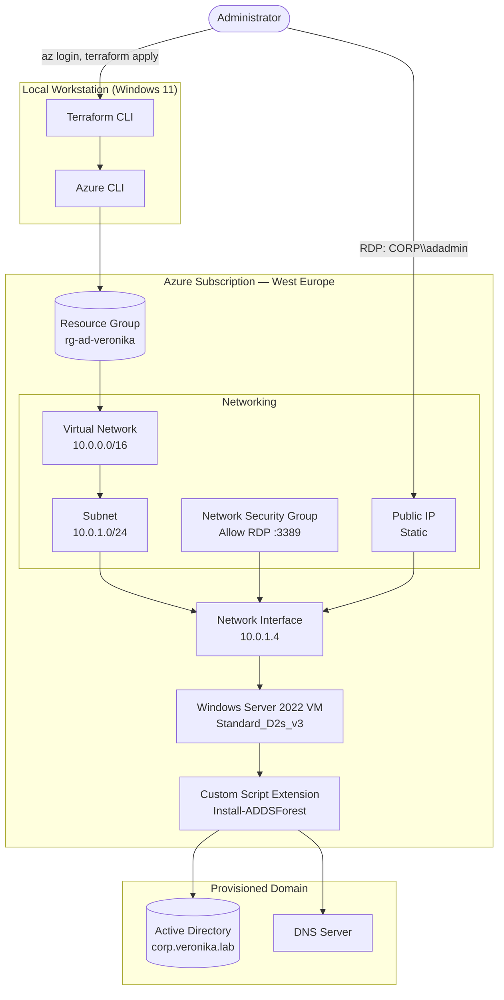

# Azure Active Directory Domain Controller — Terraform Deployment

**Infrastructure-as-Code lab:** provisioning a Windows Server 2022 Active Directory Domain Controller on Azure using Terraform, with a fully automated AD DS installation and forest promotion.

---

## Table of Contents

- [Overview](#overview)
- [Architecture](#architecture)
- [Tech Stack](#tech-stack)
- [Prerequisites](#prerequisites)
- [Repository Structure](#repository-structure)
- [Deployment](#deployment)
- [Verification](#verification)
- [Troubleshooting Log](#troubleshooting-log)
- [Cleanup](#cleanup)
- [Skills Demonstrated](#skills-demonstrated)
- [Author](#author)

---

## Overview

This project deploys a complete Active Directory environment on Azure entirely through Terraform — no manual clicking through the Azure Portal for the infrastructure, and no manual Server Manager wizards for the AD role.

A single `terraform apply` provisions:

- A dedicated resource group, virtual network, and subnet
- A network security group scoped to allow RDP
- A static public IP and network interface
- A Windows Server 2022 virtual machine
- A Custom Script Extension that installs the AD DS role and promotes the server to a new Active Directory forest, including DNS

The result is a fully functional, reproducible domain controller that can be built, verified, and torn down on demand — a pattern directly applicable to real enterprise environments where infrastructure is version-controlled rather than manually configured.

---

## Architecture



---

## Tech Stack

| Layer | Technology |
|---|---|
| Provisioning | Terraform (`hashicorp/azurerm` provider) |
| Cloud Platform | Microsoft Azure |
| Operating System | Windows Server 2022 Datacenter |
| Directory Service | Active Directory Domain Services (AD DS) + DNS |
| Automation | Azure Custom Script Extension (PowerShell) |
| CLI Tooling | Azure CLI, PowerShell |

---

## Prerequisites

- [Azure CLI](https://learn.microsoft.com/cli/azure/install-azure-cli) installed and authenticated (`az login`)
- [Terraform](https://developer.hashicorp.com/terraform/install) v1.3 or later
- An active Azure subscription with available compute quota
- Windows PowerShell (non-admin is sufficient for all Terraform commands)

---

## Repository Structure

```
az-ad-vm/
├── main.tf                    # Core resource definitions + AD DS install script
├── variables.tf                # Input variable declarations
├── outputs.tf                  # Public IP, domain name, admin username outputs
├── terraform.tfvars.example    # Sample values — copy to terraform.tfvars and edit
├── .gitignore                  # Excludes terraform.tfvars, .terraform/, state files
└── README.md
```

> **Security note:** `terraform.tfvars` contains plaintext credentials and is excluded from version control via `.gitignore`. Only `terraform.tfvars.example` (placeholder values) is committed.

---

## Deployment

```powershell
# Authenticate
az login

# Initialize providers
terraform init

# Review the execution plan
terraform plan

# Provision the environment
terraform apply
```

Apply takes roughly 8–13 minutes total: VM provisioning (~5–8 min), followed by the AD DS installation and automatic reboot (~3–5 min).

Once complete, Terraform prints the public IP, domain name, and admin username as outputs. Connect via RDP:

```powershell
mstsc /v:<public_ip>
```

**Note:** authenticate using the domain-qualified account (`CORP\adadmin` or `adadmin@corp.veronika.lab`), not a local account — the server has already been promoted to a domain controller by the time it's reachable.

---

## Verification

Run inside the VM, PowerShell as Administrator:

```powershell
Get-Service NTDS | Select-Object Name, Status
Get-ADDomain
Get-ADDomainController -Filter *
Resolve-DnsName corp.veronika.lab
```

All four commands returned clean output with no errors, confirming:
- The NTDS service (core AD engine) is running
- The forest and domain are correctly configured
- The domain controller is registered
- DNS is resolving the domain correctly

---

## Troubleshooting Log

Real issues encountered during deployment, along with root cause and resolution. Included deliberately — diagnosing infrastructure failures is as core to this skill set as a clean deployment.

| # | Issue | Root Cause | Resolution |
|---|---|---|---|
| 1 | `az login` failed with `AADSTS50076` | MFA prompt wasn't completed before the browser session closed | Re-ran `az login`, completed MFA fully, confirmed with `az account show` |
| 2 | `SkuNotAvailable` for `Standard_D2s_v3`, then `Standard_B2s`, then `Standard_B2ms` | Regional capacity exhaustion for those sizes in `uksouth` (common on trial subscriptions) | Verified availability manually in the Portal's VM size picker; moved deployment to **West Europe, Zone 3**, which had confirmed capacity |
| 3 | Portal showed "0 vCPUs of 4 remain" | Misread as a hard blocker; `az vm list-usage` confirmed 0 vCPUs were actually in use | No action needed — resolved once the correct region/size combination was in place |
| 4 | `terraform.tfvars` location value rejected | Pasted the Portal's display label (`"(Europe) West Europe"`) instead of the CLI region code | Corrected to `location = "westeurope"` |
| 5 | Intermittent `404 ResourceNotFound` on the Virtual Network mid-apply | Azure Resource Manager propagation lag — the VNet was created successfully but a near-simultaneous status check returned a stale 404 | Re-ran `apply`; used `terraform import` to reconcile Terraform's state with the VNet that had, in fact, been created |
| 6 | Import kept "not sticking" — same conflict on every subsequent apply | **OneDrive sync** was active on the project folder, silently reverting `terraform.tfstate` to an older synced version after each write | Disabled OneDrive sync for the folder (no relocation needed); state held correctly from that point on |
| 7 | RDP: "Your credentials did not work" | Domain controller was confirmed healthy via Azure **Run Command** (`NTDS: Running`, AD DS installed, account `Enabled`/not locked out) — issue was isolated to the credential itself, likely a keyboard-layout mismatch on special characters | Used Run Command to reset the domain password directly on the VM (`net user adadmin "<password>" /domain`), then logged in successfully |

### Key Lessons

- **Regional VM capacity ≠ subscription quota.** These are two independent constraints and need to be diagnosed separately — a `SkuNotAvailable` error doesn't necessarily mean you're out of quota.
- **Cloud-synced folders (OneDrive, Dropbox, Google Drive) are a real hazard for stateful tools.** Any tool that manages its own state file — Terraform included — needs exclusive, uninterrupted write access. Pause sync for that folder while the tool is active.
- **Azure's Run Command feature is a powerful diagnostic tool.** It allowed verifying AD DS health and resetting a domain password entirely through the Azure control plane, without needing a working RDP session first — useful for troubleshooting VM-level issues from a "outside-in" angle.

---

## Cleanup

```powershell
terraform destroy
```

Removes every resource created — VM, disks, NIC, public IP, NSG, VNet, and resource group — in a single confirmed operation, stopping any further billing.

---

## Skills Demonstrated

- Infrastructure as Code (Terraform: providers, resources, variables, outputs, state management)
- Azure networking fundamentals (VNets, subnets, NSGs, public IPs)
- Windows Server administration and Active Directory Domain Services deployment
- PowerShell scripting and remote diagnostics via Azure Run Command
- Systematic troubleshooting: isolating root cause across CLI auth, cloud capacity, state management, and credential issues
- Documentation of a real deployment process, including failures and their resolutions

---

## Author

**Veronika**
Cybersecurity portfolio project — built as part of hands-on Azure home lab work.
